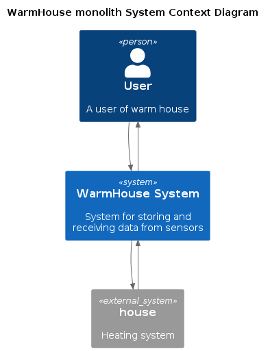
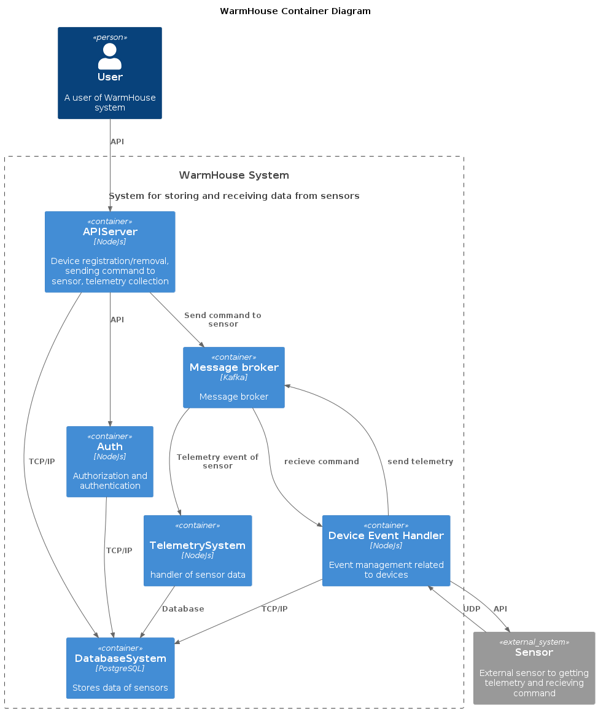
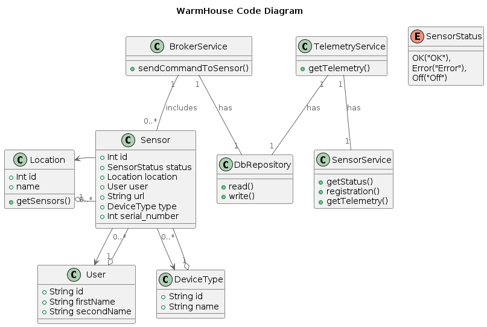
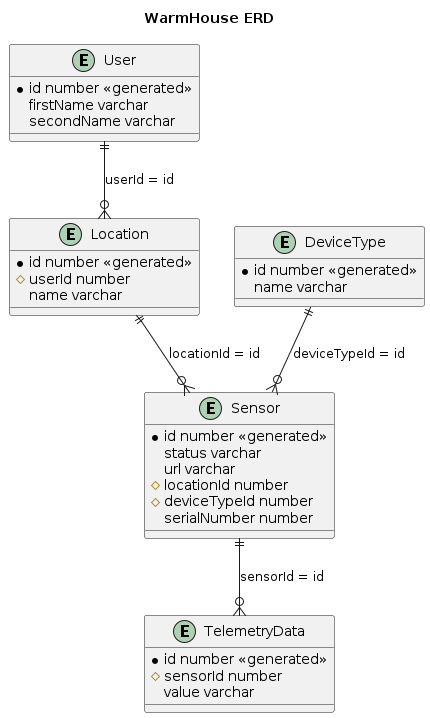

# warmhouse

# Задание 1. Анализ и планирование

### 1. Описание функциональности монолитного приложения

**Управление отоплением:**
- управлять отоплением в доме

**Мониторинг температуры:**
- можно проверять температуру

### 2. Анализ архитектуры монолитного приложения
- Архитектура приложения представляет из себя монолит на Go с СУБД Postgres.
- Всё синхронно. Никаких асинхронных вызовов, микросервисов и реактивного взаимодействия в системе нет.
- Всё управление идёт от сервера к датчику.
- Данные о температуре также получаются через запрос от сервера к датчику.

### 3. Определение доменов и границы контекстов
- Домен: Управление устройствами
  + Поддомен: Взаимодействие с устройствами
    + Контекст: Управление командами устройств
  + Поддомен: Регистрация устройств
  + Поддомен Удаление устройств
  + Поддомен Сценарии устройств 
    + Контекст: Добавление сценария
- Домен: Телеметрия
  + Поддомен Сбор показателей
  + Поддомен: Хранение показателей с устройств
  + Поддомен: Отображение показателей
- Домен: Безопасность
  + Aутентификация
  + Авторизация

### **4. Проблемы монолитного решения**
- Все компоненты находятся в одном приложении
- Большая связанность системы
- Требует остановки всего приложения при разворачивании
### 5. Визуализация контекста системы — диаграмма С4



# Задание 2. Проектирование микросервисной архитектуры

В этом задании вам нужно предоставить только диаграммы в модели C4. Мы не просим вас отдельно описывать получившиеся микросервисы и то, как вы определили взаимодействия между компонентами To-Be системы. Если вы правильно подготовите диаграммы C4, они и так это покажут.

**Диаграмма контейнеров (Containers)**



**Диаграмма компонентов (Components)**


**Диаграмма кода (Code)**



# Задание 3. Разработка ER-диаграммы



# Задание 4. Создание и документирование API

### 1. Тип API

Я использовал asyncApi на основе брокере сообщений kafka, так как это система более устойчива к нагрузке и масштабированию например добавлением нового консьюмера или добавлением нового сервера для кафки

### 2. Документация API

[Документация Kafka](https://ikutin6543.github.io/architecture-pro-warmhouse/kafka/)
# Задание 5. Работа с docker и docker-compose

# **Задание 6. Разработка MVP**

- В рамках задания было немного изменена логика в **/api/v1/sensors** на запрос к **telemetry**
- добавлен роут /api/v1/sensors/command/:id
```
BODY {
        "command":"turnOff"
     }
```

Были созданы микросервисы **kafka**, **producer**, **consumer**, **telemetry**

## kafka
Служит брокером сообщений для отправки команды датчикам

## producer
Служит api сервером для приема команд от юзеров и отправки их в кафку
```
// отправка команды датчику
POST /api/v1/command/sensor/:sensorId
BODY {
        command:"turnOn"
     }
```

## consumer
Служит консьюмером для последующей передачи непосредственно датчикам в данной реализации будет сообщение в логах

## telemetry
Служит UDP сервером и api сервером для приема показаний с датчиков и записи в таблицу telemetry


```
// запись телеметрии
// UDP слушает порт 41234 и получат данные с датчиков в формате 
{
  sensorId: 1,
  value: 37.1
}
```

```
// получение последней телеметрии с датчика 
GET /sensor/:id 
```